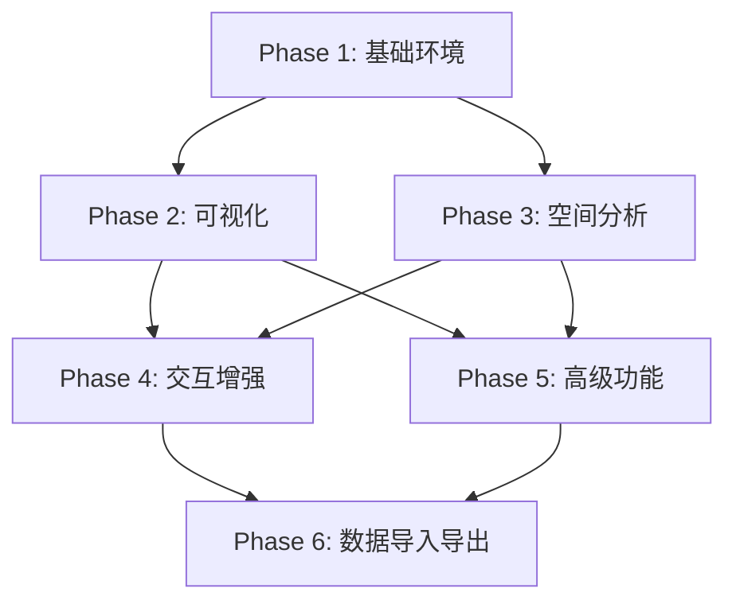

# GIS 地理信息功能分阶段详细实现文档

---

## 文档概述

本文档基于 `gis.md` 需求分析，将 GIS 功能划分为 **6个核心阶段**，每个阶段包含详细的任务分解、优先级、依赖关系和验收标准，确保所有功能完整实现。

---

## 阶段总览

| 阶段 | 周期 | 核心目标 | 关键功能 | 交付物 |
|-----|------|---------|---------|-------|
| **Phase 1** | 2周 | 基础环境搭建 | 地图库集成、地理坐标字段 | 地图视图组件、字段类型扩展 |
| **Phase 2** | 2周 | 数据可视化基础 | 点标记、热力图、聚合 | 可视化图层组件 |
| **Phase 3** | 2周 | 空间查询分析 | 距离计算、范围查询、邻近分析 | 空间计算工具类 |
| **Phase 4** | 2周 | 地图交互增强 | 点击详情、拖拽、测量、绘制 | 交互工具组件 |
| **Phase 5** | 2周 | 高级功能 | 实时追踪、地理围栏、路径规划 | 高级功能模块 |
| **Phase 6** | 1周 | 数据导入导出 | GeoJSON/KML/GPX支持 | 数据格式转换器 |

---

## Phase 1: 基础环境搭建（第1-2周）

### 1.1 目标
搭建 GIS 功能的基础技术框架，实现地图渲染和地理坐标字段支持。

### 1.2 任务分解

#### 1.2.1 技术选型与环境配置

| 任务 | 描述 | 优先级 | 依赖 |
|-----|------|-------|------|
| **P0** | 安装 Mapbox GL JS v3.x | 必须 | 无 |
| **P0** | 安装 Turf.js v6.x | 必须 | 无 |
| **P0** | 配置地图服务密钥（高德/Mapbox） | 必须 | 无 |
| **P1** | 配置 TypeScript 类型声明 | 重要 | 地图库安装完成 |

#### 1.2.2 核心组件开发

| 任务 | 描述 | 优先级 | 依赖 |
|-----|------|-------|------|
| **P0** | 创建 MapView.vue 地图视图组件 | 必须 | 地图库配置完成 |
| **P0** | 创建 MapService.ts 地图服务类 | 必须 | MapView.vue |
| **P0** | 实现地理坐标字段类型（geo） | 必须 | 字段类型定义 |
| **P1** | 实现地址字段类型（address） | 重要 | 地理编码服务 |
| **P1** | 实现区域字段类型（region） | 重要 | 行政区划数据 |

#### 1.2.3 字段类型扩展

| 字段类型 | 任务 | 验收标准 |
|---------|------|---------|
| **地理坐标** | 支持经纬度存储、地图选点 | 可在地图上点击选择坐标 |
| **地址字段** | 支持地址输入、自动地理编码 | 输入地址自动解析为坐标 |
| **区域字段** | 省/市/区三级联动选择 | 下拉选择行政区划 |

#### 1.2.4 地图视图基础功能

| 功能 | 任务 | 验收标准 |
|-----|------|---------|
| **地图渲染** | 集成高德/百度/OSM底图 | 三种地图源可切换 |
| **缩放控制** | 1-18级缩放 | 鼠标滚轮/按钮缩放 |
| **视图切换** | 2D/3D切换 | 按钮切换视图模式 |
| **定位功能** | 定位到当前位置 | 使用HTML5 Geolocation |

### 1.3 交付物清单

| 交付物 | 路径 | 说明 |
|-------|------|------|
| MapView.vue | `src/components/MapView.vue` | 地图视图组件 |
| MapService.ts | `src/services/MapService.ts` | 地图服务类 |
| GeoField.ts | `src/types/geo.ts` | GIS类型定义 |
| SpatialUtil.ts | `src/utils/SpatialUtil.ts` | 空间计算工具 |
| 配置文件 | `src/config/map.ts` | 地图服务配置 |

---

## Phase 2: 数据可视化基础（第3-4周）

### 2.1 目标
实现多种地图可视化方式，支持点标记、热力图、聚合展示等。

### 2.2 任务分解

#### 2.2.1 点标记可视化

| 任务 | 描述 | 优先级 | 依赖 |
|-----|------|-------|------|
| **P0** | 实现 MarkerLayer 标记图层 | 必须 | Phase 1 |
| **P0** | 支持自定义标记图标 | 必须 | MarkerLayer |
| **P1** | 支持标记聚类显示 | 重要 | MarkerLayer |
| **P1** | 支持标记动画效果 | 重要 | MarkerLayer |

#### 2.2.2 热力图可视化

| 任务 | 描述 | 优先级 | 依赖 |
|-----|------|-------|------|
| **P0** | 实现 HeatmapLayer 热力图层 | 必须 | Phase 1 |
| **P1** | 支持热力图参数配置 | 重要 | HeatmapLayer |
| **P1** | 支持热力图颜色渐变 | 重要 | HeatmapLayer |

#### 2.2.3 聚合标记

| 任务 | 描述 | 优先级 | 依赖 |
|-----|------|-------|------|
| **P0** | 实现 SuperCluster 聚合 | 必须 | MarkerLayer |
| **P1** | 支持聚合级别配置 | 重要 | SuperCluster |
| **P1** | 聚合点击展开 | 重要 | SuperCluster |

#### 2.2.4 路径可视化

| 任务 | 描述 | 优先级 | 依赖 |
|-----|------|-------|------|
| **P0** | 实现 LineLayer 路径图层 | 必须 | Phase 1 |
| **P1** | 支持路径动画 | 重要 | LineLayer |
| **P1** | 支持路径样式配置 | 重要 | LineLayer |

#### 2.2.5 区域着色

| 任务 | 描述 | 优先级 | 依赖 |
|-----|------|-------|------|
| **P0** | 实现 FillLayer 填充图层 | 必须 | Phase 1 |
| **P1** | 支持按数据值着色 | 重要 | FillLayer |
| **P1** | 支持图例显示 | 重要 | FillLayer |

### 2.3 验收标准

| 功能 | 验收标准 |
|-----|---------|
| 点标记 | 支持1000+标记渲染，点击显示详情 |
| 热力图 | 支持自定义颜色范围，数据变化实时更新 |
| 聚合标记 | 缩放时自动聚合/展开，支持10000+点 |
| 路径规划 | 支持多点路径绘制，显示路径长度 |
| 区域着色 | 支持行政区划着色，显示数值图例 |

---

## Phase 3: 空间查询分析（第5-6周）

### 3.1 目标
实现空间计算和查询能力，支持距离计算、范围查询、邻近分析等。

### 3.2 任务分解

#### 3.2.1 基础空间计算

| 任务 | 描述 | 优先级 | 依赖 |
|-----|------|-------|------|
| **P0** | 实现两点距离计算 | 必须 | Turf.js |
| **P0** | 实现多边形面积计算 | 必须 | Turf.js |
| **P1** | 实现点到线距离 | 重要 | Turf.js |
| **P1** | 实现方位角计算 | 重要 | Turf.js |

#### 3.2.2 范围查询

| 任务 | 描述 | 优先级 | 依赖 |
|-----|------|-------|------|
| **P0** | 实现圆形范围查询 | 必须 | SpatialUtil |
| **P0** | 实现矩形范围查询 | 必须 | SpatialUtil |
| **P0** | 实现多边形范围查询 | 必须 | SpatialUtil |
| **P1** | 实现空间索引优化 | 重要 | 范围查询 |

#### 3.2.3 邻近分析

| 任务 | 描述 | 优先级 | 依赖 |
|-----|------|-------|------|
| **P0** | 实现 KNN 邻近查询 | 必须 | Turf.js |
| **P1** | 实现距离排序 | 重要 | KNN |
| **P1** | 实现邻近搜索优化 | 重要 | KNN |

#### 3.2.4 区域统计

| 任务 | 描述 | 优先级 | 依赖 |
|-----|------|-------|------|
| **P0** | 实现按行政区划统计 | 必须 | 区域字段 |
| **P1** | 实现自定义区域统计 | 重要 | 几何字段 |
| **P1** | 实现统计图表联动 | 重要 | Dashboard |

#### 3.2.5 路径分析

| 任务 | 描述 | 优先级 | 依赖 |
|-----|------|-------|------|
| **P0** | 集成第三方路径API | 必须 | 高德地图API |
| **P1** | 实现多点路径规划 | 重要 | 路径API |
| **P1** | 实现路径优化（TSP） | 重要 | 路径API |

### 3.3 验收标准

| 功能 | 验收标准 |
|-----|---------|
| 距离计算 | 支持球面距离，精度<1米 |
| 范围查询 | 支持三种范围类型，响应<500ms |
| 邻近分析 | K=10时响应<300ms |
| 区域统计 | 支持按省/市/区三级统计 |
| 路径分析 | 支持起点终点输入，返回最优路径 |

---

## Phase 4: 地图交互增强（第7-8周）

### 4.1 目标
实现丰富的地图交互功能，提升用户体验。

### 4.2 任务分解

#### 4.2.1 基础交互

| 任务 | 描述 | 优先级 | 依赖 |
|-----|------|-------|------|
| **P0** | 点击标记显示详情弹窗 | 必须 | MarkerLayer |
| **P0** | 支持标记拖拽定位 | 必须 | MarkerLayer |
| **P1** | 支持标记批量选择 | 重要 | MarkerLayer |
| **P1** | 支持标记信息编辑 | 重要 | 详情弹窗 |

#### 4.2.2 测量工具

| 任务 | 描述 | 优先级 | 依赖 |
|-----|------|-------|------|
| **P0** | 实现距离测量工具 | 必须 | MapService |
| **P0** | 实现面积测量工具 | 必须 | MapService |
| **P1** | 实现角度测量工具 | 重要 | MapService |

#### 4.2.3 绘制工具

| 任务 | 描述 | 优先级 | 依赖 |
|-----|------|-------|------|
| **P0** | 实现点绘制工具 | 必须 | MapService |
| **P0** | 实现线绘制工具 | 必须 | MapService |
| **P0** | 实现多边形绘制工具 | 必须 | MapService |
| **P1** | 实现矩形绘制工具 | 重要 | MapService |

#### 4.2.4 导出功能

| 任务 | 描述 | 优先级 | 依赖 |
|-----|------|-------|------|
| **P0** | 实现地图图片导出 | 必须 | Mapbox API |
| **P1** | 实现地图数据导出 | 重要 | GeoJSON |

### 4.3 验收标准

| 功能 | 验收标准 |
|-----|---------|
| 点击详情 | 弹窗显示完整记录信息，支持编辑 |
| 拖拽定位 | 拖拽标记后坐标实时更新 |
| 测量工具 | 距离/面积实时显示，单位可切换 |
| 绘制工具 | 支持点/线/多边形，可撤销/重做 |
| 导出功能 | 支持PNG/JPG格式，分辨率可选 |

---

## Phase 5: 高级功能实现（第9-10周）

### 5.1 目标
实现差异化亮点功能，提升产品竞争力。

### 5.2 任务分解

#### 5.2.1 实时位置追踪

| 任务 | 描述 | 优先级 | 依赖 |
|-----|------|-------|------|
| **P0** | 实现 WebSocket 实时推送 | 必须 | 后端支持 |
| **P0** | 实现位置动画轨迹 | 必须 | LineLayer |
| **P1** | 实现历史轨迹回放 | 重要 | 位置数据存储 |
| **P1** | 实现轨迹播放控制 | 重要 | 历史轨迹 |

#### 5.2.2 地理围栏

| 任务 | 描述 | 优先级 | 依赖 |
|-----|------|-------|------|
| **P0** | 实现围栏定义功能 | 必须 | 绘制工具 |
| **P0** | 实现围栏检测算法 | 必须 | SpatialUtil |
| **P1** | 实现围栏事件触发 | 重要 | Workflow |
| **P1** | 实现围栏告警通知 | 重要 | 事件触发 |

#### 5.2.3 三维可视化

| 任务 | 描述 | 优先级 | 依赖 |
|-----|------|-------|------|
| **P0** | 实现3D地图视图 | 必须 | Mapbox 3D |
| **P1** | 实现建筑轮廓展示 | 重要 | 3D图层 |
| **P1** | 实现3D视角控制 | 重要 | Mapbox 3D |

#### 5.2.4 路径规划优化

| 任务 | 描述 | 优先级 | 依赖 |
|-----|------|-------|------|
| **P0** | 实现多点路径优化 | 必须 | TSP算法 |
| **P1** | 实现避障功能 | 重要 | 路径API |
| **P1** | 实现多方案对比 | 重要 | 路径API |

### 5.3 验收标准

| 功能 | 验收标准 |
|-----|---------|
| 实时追踪 | 位置更新延迟<1s，轨迹动画流畅 |
| 地理围栏 | 检测准确率>99%，事件触发延迟<100ms |
| 三维可视化 | 3D建筑展示，支持倾斜视角 |
| 路径优化 | 多点优化时间<1s，路径长度优化率>10% |

---

## Phase 6: 数据导入导出（第11周）

### 6.1 目标
支持多种空间数据格式的导入导出，实现与其他GIS系统的对接。

### 6.2 任务分解

#### 6.2.1 格式支持

| 任务 | 描述 | 优先级 | 依赖 |
|-----|------|-------|------|
| **P0** | 实现 GeoJSON 格式支持 | 必须 | 无 |
| **P0** | 实现 KML 格式支持 | 必须 | kml-parser |
| **P1** | 实现 GPX 格式支持 | 重要 | gpx-parser |
| **P1** | 实现 Shapefile 格式支持 | 重要 | shp-js |

#### 6.2.2 导入功能

| 任务 | 描述 | 优先级 | 依赖 |
|-----|------|-------|------|
| **P0** | 实现文件上传解析 | 必须 | 格式解析器 |
| **P0** | 实现数据映射配置 | 必须 | 字段类型 |
| **P1** | 实现批量导入 | 重要 | 数据映射 |

#### 6.2.3 导出功能

| 任务 | 描述 | 优先级 | 依赖 |
|-----|------|-------|------|
| **P0** | 实现 GeoJSON 导出 | 必须 | GeoJSON格式 |
| **P1** | 实现 KML 导出 | 重要 | KML格式 |
| **P1** | 实现数据筛选导出 | 重要 | 筛选功能 |

### 6.3 验收标准

| 功能 | 验收标准 |
|-----|---------|
| GeoJSON | 支持导入导出，数据完整性100% |
| KML | 支持Google Earth格式兼容 |
| GPX | 支持GPS轨迹数据 |
| 批量导入 | 支持1000+记录批量导入 |

---

## 依赖关系图

---

## 资源需求

| 资源类型 | 需求 |
|---------|------|
| **前端开发** | 1-2人 |
| **后端开发** | 1人（实时追踪需要） |
| **地图API密钥** | 高德/百度/Mapbox |
| **测试环境** | 支持WebSocket的服务器 |

---

## 里程碑检查点

| 检查点 | 时间 | 检查内容 |
|-------|------|---------|
| M1 | 第2周 | 基础地图集成完成 |
| M2 | 第4周 | 可视化功能完成 |
| M3 | 第6周 | 空间分析功能完成 |
| M4 | 第8周 | 交互功能完成 |
| M5 | 第10周 | 高级功能完成 |
| M6 | 第11周 | 全部功能验收 |

---

**文档版本**: v1.0  
**创建日期**: 2026年6月  
**适用项目**: 多维表格可视化平台